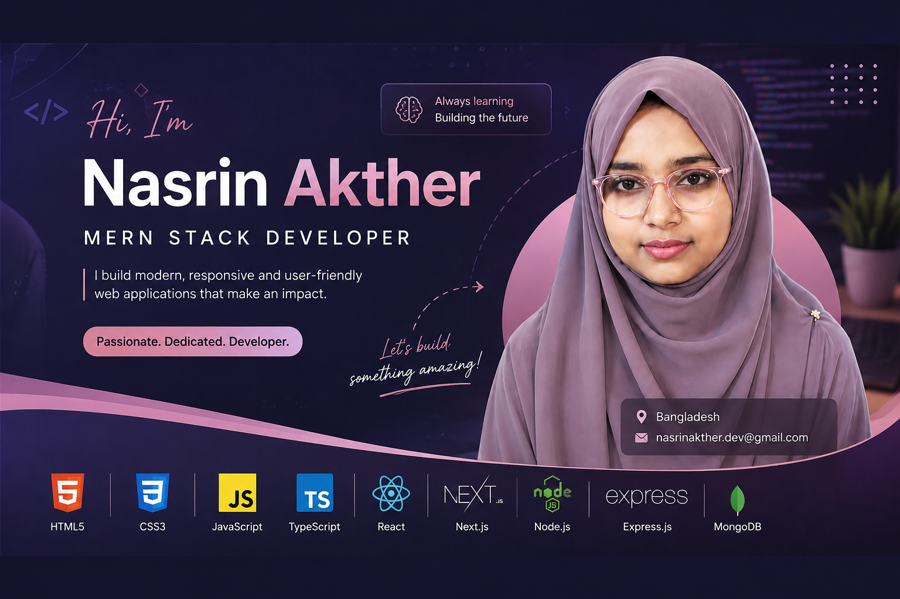

<!-- ======================= BANNER ======================= -->

  

<!-- ======================= INTRO ======================= -->

<h1 align="center">Hi 👋, I'm Nasrin Akther</h1>

<h3 align="center">
  🎓 Student | 🌐 Aspiring Web Developer
</h3>

  
  

---

## 👩‍💻 About Me

I'm a passionate student and aspiring web developer who enjoys
building modern and user-friendly web applications.

I love learning new technologies and improving my coding skills
through practice and real-world projects.

I'm currently focused on React, React with TypeScript, and modern
full-stack web development. 🚀

### 🚀 Currently Learning & Working On

- 🌱 Learning React.js
- ⚛️ Exploring React with TypeScript
- 🚀 Exploring Next.js
- 💻 Building full-stack web projects
- 🧠 Improving problem-solving skills
- 📚 Continuously learning modern web technologies

---

## 🛠️ Tech Stack

### 🎨 Frontend

  

### ⚙️ Backend & Database

  

### 🧰 Tools & Technologies

  

---

## 🌐 Connect With Me

---

## 📊 GitHub Stats

  
  
  

---

## 🔥 GitHub Streak

  

---

## 👀 Profile Visitors

  

---

<h3 align="center">
  ✨ Thanks for visiting my profile! ✨
</h3>

  💙 Keep Learning • Keep Building • Keep Growing 🚀

